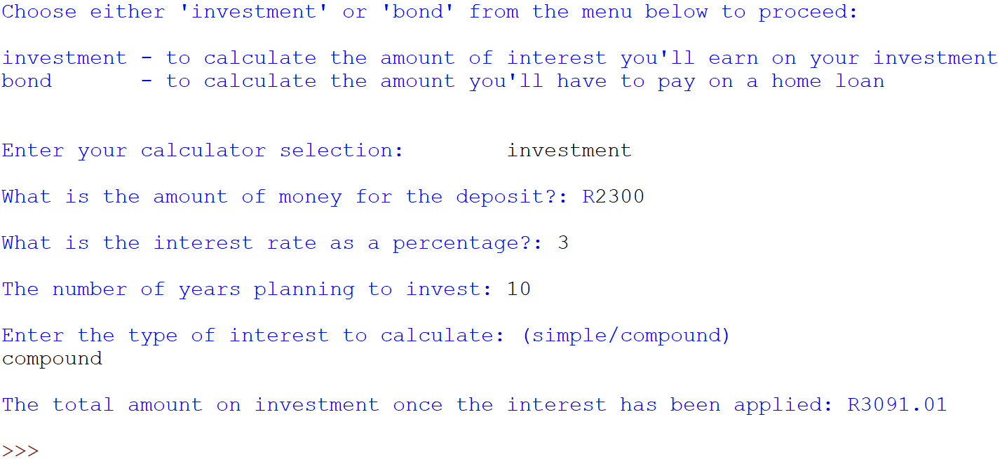
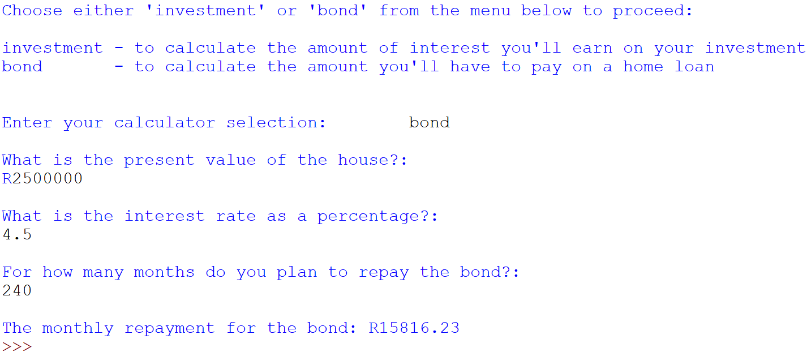

**Importance of the Project:**

This project holds significant importance as it showcases the practical application of variables, various data types, and control structures, specifically if-elif-else statements. The primary goal is to demonstrate competence in creating a user-friendly program for financial calculations. It caters to the needs of a small financial company, enabling users to access two essential financial calculators: an investment calculator and a home loan repayment calculator. By offering these tools, it empowers individuals to make informed financial decisions regarding their investments and home loans.

**What the Project Does:**

The project involves the creation of a Python program named "finance_calculators.py" that provides users with a choice between two financial calculations: investment and home loan repayment. It ensures user-friendliness by recognising various input forms, including both capitalisation and lowercase inputs. If an invalid input is provided, the program offers appropriate error messages. 

For the 'investment' option, users are prompted to input the amount of money they plan to deposit, the interest rate (in percentage), the number of years for investment, and whether they desire 'simple' or 'compound' interest. Depending on the chosen interest type, the program calculates and presents the expected returns using the relevant formula.

On the other hand, for the 'bond' option, users provide details such as the present value of the house, the interest rate, and the number of months for bond repayment. The program then calculates and displays the monthly bond repayment amount. This project facilitates financial planning and decision-making, emphasising accuracy, readability, and user-friendly output presentation.

# Installation section
*Tell other users how to install your project locally*

1. Install Python: 
    1. Download Python IDLE 3.7.0 to run the program
    1. Visit the official Python website at https://www.python.org/downloads/windows/ in your web browser.
    1. Click on the "Download Python 3.7.0" button
    1. Under Files section, download the one that matches your system architecture (32-bit or 64-bit). Most modern systems are 64-bit.
    1. Click on the installer to download it.
    1. Locate the downloaded installer file and double-click on it to run the Python installer.
    1. Check the box that says "Add Python 3.7.0 to PATH." 
    1. Click the "Install Now" button to start the installation process.
     
1. Open the Command Prompt (cmd)
    1. Clone repository: `git clone <repository-url>`
    1. Navigate to the project directory: `cd "path\to\finance_calculators.py"`

1. Create a Virtual Environment:
    1. Create a folder for new virtual env: `mkdir Virtual_env`
    1. Navigate to folder: `cd Virtual_env`
    1. Create a virtual environment: `virtualenv taskvenv`

1. Activate the Virtual Environment:
    + In Windows Command Prompt (Admin):
    1. In your Virtual_env folder there will be a folder called Scripts. Copy its path.
    1. Change directory to Scripts `cd "path\to\scripts\in\virtual\environment"`
    1. Activate virtual environment: `activate.bat`
    1. You will see (bookshelfvenv) at the start of cmd line
    1. change directory to app root directory: `cd "path\to\app"`

1. Verify Python installation: `python --version`
1. Verify pip installation: `pip --version`
1. Install the dependencies: `pip install -r requirements.txt`    

# Usage section
*Instruct others on how to use your project after they’ve installed it*

*Outline the steps necessary to build and run your application with venv and Docker:*
+ Activate virtual environment [see above]

+ Install Docker desktop @ https://www.docker.com/products/docker-desktop
+ Open Docker Desktop
+ login to Docker Hub @ https://hub.docker.com/

## Use the Command Prompt
1. Check that Docker desktop was successfully installed: `docker run hello-world`
1. Build the docker image: `docker build -t calculator ./` 
1. Run the docker image: `docker run -it calculator`
1. Deactivate the Virtual Environment: `deactivate`

## Use Docker Playground
1. Follow: https://labs.play-with-docker.com/
1. Start a new instance

In the terminal: 
1. Copy command from Docker Hub @ https://hub.docker.com/repository/docker/kcse1/finance/tags?page=1&ordering=last_updated: `docker pull kcse1/finance:calculator`
1. Run the docker image: `docker run -it kcse1/finance:calculator`
1. Close session on Docker Playground

## Use Python IDLE
Run the program (F5) and select an option from the menu

1. Deactivate virtual environment in cmd when you are done working: `deactivate`

*Include screenshots of your project in action*

# Credits
*highlights and links to the authors of your project if the project has been created by more than one person*

@KC-software-en

# Add a URL to your GitHub repository

https://github.com/KC-software-en/bookish-adventure

